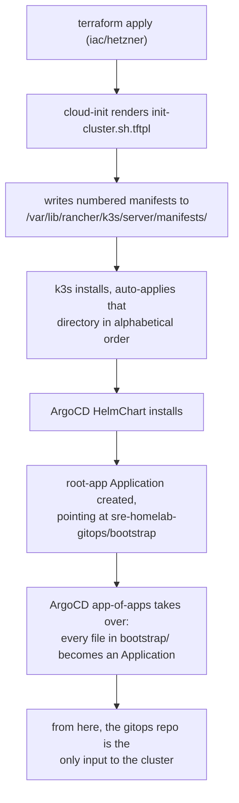
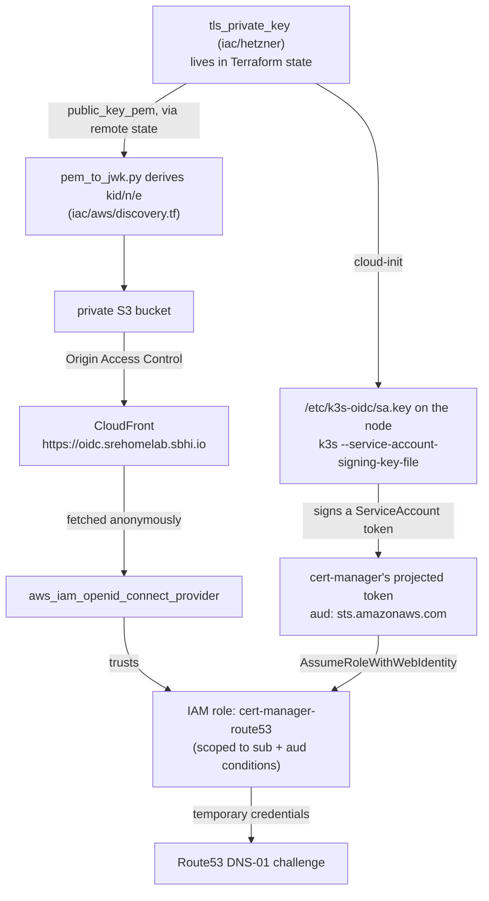

# sre-homelab

Terraform for a single-node [k3s](https://k3s.io/) homelab on [Hetzner Cloud](https://www.hetzner.com/cloud/), where `cert-manager` authenticates to AWS Route53 by federating the cluster's own identity into IAM — the same mechanism EKS calls IRSA — instead of holding a static AWS access key.

This repo builds the cluster and the AWS identity it uses. Everything that actually *runs* on the cluster — ArgoCD applications, ingress rules, RBAC — lives in the companion repo, [`sre-homelab-gitops`](https://github.com/sbhiii/sre-homelab-gitops). The two are meant to be read together; this README explains the infrastructure side in full, and links out to the other repo where the split matters.

## Table of contents

- [What this is](#what-this-is)
- [Architecture](#architecture)
  - [Three Terraform modules, not one](#three-terraform-modules-not-one)
  - [The bootstrap chain](#the-bootstrap-chain)
  - [The OIDC trust chain](#the-oidc-trust-chain)
  - [Why not EKS, IAM Roles Anywhere, or SPIFFE](#why-not-eks-iam-roles-anywhere-or-spiffe)
- [Repository layout](#repository-layout)
- [Prerequisites](#prerequisites)
  - [Tools](#tools)
  - [Accounts](#accounts)
  - [Background knowledge](#background-knowledge)
- [Getting started](#getting-started)
- [Day-2 operations](#day-2-operations)
- [Security model](#security-model)
- [Known limitations](#known-limitations)
- [Cost](#cost)
- [Troubleshooting](#troubleshooting)
- [Related repository](#related-repository)

## What this is

A homelab is usually one of two things: a single VM with everything crammed onto it, or an over-engineered attempt to replicate a cloud provider's internal platform for an audience of one. This project sits deliberately in between. It's a **real, single-node k3s cluster**, bootstrapped entirely from Terraform and GitOps with no manual `kubectl apply` — but its interesting part isn't the cluster, it's how the cluster proves its identity to AWS.

`cert-manager` needs to write TXT records into Route53 to complete ACME DNS-01 challenges. The obvious way to grant that is an IAM user with an access key, dropped into a Kubernetes Secret. That's also the wrong way: it's a long-lived, unrotated, human-shaped credential sitting in a cluster that has no business holding one. This repo instead:

1. Generates the cluster's own ServiceAccount token-signing key in Terraform.
2. Publishes the corresponding JWKS to a URL the cluster owns (`https://oidc.srehomelab.sbhi.io`), fronted by CloudFront.
3. Registers that URL as an IAM OIDC identity provider.
4. Grants a narrowly-scoped IAM role to exactly one ServiceAccount (`system:serviceaccount:cert-manager:cert-manager`), via `sts:AssumeRoleWithWebIdentity`.

No AWS credential is stored anywhere — not in this repo, not in the cluster, not in Terraform state as a *secret* (the signing key is a different story, see [Security model](#security-model)). `cert-manager` mints a token, AWS validates it against a public key it fetched itself, and the token proves nothing except "I am this specific ServiceAccount, in this specific cluster."

This is precisely what EKS does under the hood for IRSA. The difference is that EKS runs the OIDC issuer for you. Here, the issuer is homemade — Terraform, S3, and CloudFront standing in for what the managed control plane would otherwise provide. That gap, and what it costs to close by hand, is the interesting engineering in this repo.

## Architecture

### Three Terraform modules, not one

```
iac/
  bootstrap/   state bucket only. Local state, on purpose. Applied once, ever.
  aws/         OIDC provider, IAM role, Route53 zone, discovery documents, DNS
  hetzner/     the cluster itself: network, firewall, server, signing key
```

`iac/hetzner` recreates its server on almost every meaningful change, because the node's `user_data` is immutable on Hetzner — there is no in-place update, only replace. If IAM and DNS lived in the same state as the node, every rebuild would put unrelated cloud resources in the same blast radius for no reason. Splitting them means a node rebuild touches exactly the node.

`iac/bootstrap` is the odd one out: it creates the S3 bucket that the other two modules use as their *own* backend, so it cannot store its state inside a bucket that doesn't exist yet. It keeps local state permanently, by design — see [`iac/bootstrap/README.md`](iac/bootstrap/README.md).

Apply order is always **`hetzner` → `aws`**, never the reverse. `iac/aws` reads two things out of `iac/hetzner`'s state via `terraform_remote_state`:

- `sa_public_key_pem` — the public half of the signing key, used to build the JWKS.
- `nodes_public_ips` — the node's current IP, used for the wildcard DNS record in [`iac/aws/apps-dns.tf`](iac/aws/apps-dns.tf).

Only the *public* key ever crosses that boundary. The private half stays inside `iac/hetzner`'s state and is never exported as an output.

### The bootstrap chain

Nothing is ever applied to the cluster by hand. The whole chain, from an empty Hetzner project to a syncing ArgoCD instance, is:



Concretely, [`iac/hetzner/scripts/init-cluster.sh.tftpl`](iac/hetzner/scripts/init-cluster.sh.tftpl) does five things at first boot:

1. Applies a couple of sysctl tweaks k3s wants (`fs.inotify.max_user_instances`).
2. Writes three Terraform-rendered manifests into k3s's auto-apply directory, prefixed `01-`, `02-`, `03-` — k3s applies that directory alphabetically, which is the entire ordering mechanism. They are: the ArgoCD `HelmChart`, a `Secret` holding the gitops repo credentials, and the `root-app` `Application` that makes ArgoCD self-managing from that point on.
3. Writes the ServiceAccount signing keypair to `/etc/k3s-oidc/` (`0600` on the private half).
4. Installs k3s itself, with `--disable traefik --disable servicelb` (both are reprovided through GitOps instead) and four `--kube-apiserver-arg` flags that turn on OIDC federation — see below.
5. Installs a `systemd` unit blocking pod traffic to Hetzner's metadata service — see [Security model](#security-model).

Everything after step 2 is GitOps: `root-app` is an app-of-apps, so every file under `sre-homelab-gitops/bootstrap/` becomes its own ArgoCD `Application`, synced in the order given by its `argocd.argoproj.io/sync-wave` annotation. Manual `kubectl edit` on anything ArgoCD owns gets reverted on the next reconcile.

### The OIDC trust chain



The property this whole design is built around: **the signing key lives in Terraform state, not on the node.** A `user_data` change replaces the Hetzner server, but leaves the `tls_private_key` resource in [`iac/hetzner/keys.tf`](iac/hetzner/keys.tf) completely untouched. The published JWKS, the IAM provider, and the trust policy all stay valid across a node rebuild — only a full `terraform destroy` of the `hetzner` module mints a new identity, and that requires re-applying `iac/aws` afterward to republish the new key.

A few details that took real iteration to get right, and are worth knowing before touching this code:

- **The `kid` must byte-match exactly.** Kubernetes computes a token's `kid` header as `base64url(sha256(DER-encoded PKIX public key))`. [`iac/aws/scripts/pem_to_jwk.py`](iac/aws/scripts/pem_to_jwk.py) reimplements that from scratch in pure Python (no `cryptography` dependency, so it runs anywhere Terraform does) via a hand-rolled DER/TLV parser. [`test_pem_to_jwk.py`](iac/aws/scripts/test_pem_to_jwk.py) pins it against a fixture cross-verified with `openssl`. This was independently verified against the live cluster's own JWKS output and matched exactly — see the git history for `iac/aws/discovery.tf` if you want the receipts.
- **`cache_control` on the discovery objects is load-bearing, not decoration.** CloudFront's managed `CachingOptimized` policy defaults to a 24-hour TTL. Without an explicit override, rotating the signing key would leave AWS reading a stale JWKS and rejecting every token with an opaque error for up to a day. It's capped at five minutes instead.
- **The trust policy carries two conditions, not one.** `${issuer_host}:sub` pins the exact ServiceAccount; `${issuer_host}:aud` pins the audience to `sts.amazonaws.com`. Dropping the `aud` condition is the single most common IRSA misconfiguration in the wild — it lets a token minted for *any* audience assume the role.
- **`route53:ListHostedZonesByName` is deliberately absent from the IAM policy.** The gitops repo's `ClusterIssuer` sets `hostedZoneID` explicitly, which skips the lookup that permission would otherwise be needed for. The policy is two actions on one zone; see [`iac/aws/iam.tf`](iac/aws/iam.tf).

### Why not EKS, IAM Roles Anywhere, or SPIFFE

Worth being explicit about, since it's the first question anyone who knows this space will ask.

**EKS** would give you all of this for free — a managed OIDC issuer, automatic key rotation, no S3/CloudFront to run. It also costs money per cluster and defeats the point of running k3s on a single Hetzner box. What's built here is the same mechanism EKS uses, minus the managed control plane doing the work.

**IAM Roles Anywhere** is AWS's purpose-built answer for non-Kubernetes workloads outside AWS: X.509 trust anchors, no public JWKS, no DNS, no CloudFront. It loses here for a specific reason — `cert-manager`'s Route53 solver natively supports `auth.kubernetes.serviceAccountRef` and does not support Roles Anywhere. Using it would mean running `aws_signing_helper` sidecars and a PKI to feed a tool that already speaks projected tokens natively.

**SPIFFE/SPIRE** is the real gold standard for workload identity, and it would fix the one thing this design can't: it never needs to override the cluster's own SA signing key, so the private key never has to leave the SPIRE Server's own storage. The trade is a control plane (SPIRE Server + Agent + an OIDC discovery provider of its own) for a single node with one AWS consumer. Worth reconsidering if this cluster ever needs mTLS between services, or grows past a handful of AWS-integrated workloads.

## Repository layout

```
iac/
  bootstrap/              state bucket (local state, applied once)
    main.tf                aws_s3_bucket + versioning + encryption + public-access-block
    variables.tf, outputs.tf, providers.tf, README.md

  aws/                     IAM/DNS/discovery stack (state in S3)
    dns.tf                  Route53 zone, ACM certificate (us-east-1) + validation
    discovery.tf             JWKS derivation, S3 bucket, CloudFront, OAC, bucket policy
    iam.tf                   IAM OIDC provider, cert-manager IAM role and trust policy
    apps-dns.tf              wildcard A record for the cluster's ingress hostnames
    scripts/
      pem_to_jwk.py           PEM -> JWK, pure stdlib
      test_pem_to_jwk.py      unit tests against a cross-verified fixture
    backend.tf, providers.tf, variables.tf, outputs.tf

  hetzner/                 the cluster itself (state in S3)
    main.tf                  network, firewall, hcloud_server
    keys.tf                   tls_private_key for SA token signing
    scripts/init-cluster.sh.tftpl   cloud-init: manifests, signing key, k3s install, iptables rule
    manifests/                ArgoCD HelmChart, repo credentials, root Application (all templated)
    backend.tf, providers.tf, variables.tf, outputs.tf
```

## Prerequisites

### Tools

| Tool | Used for | Notes |
|---|---|---|
| [Terraform](https://developer.hashicorp.com/terraform) | everything under `iac/` | developed against 1.14.x; no `required_version` is pinned in code |
| [AWS CLI v2](https://docs.aws.amazon.com/cli/) | applying `iac/aws` and `iac/bootstrap`, and diagnosing the trust chain | needs credentials the Terraform AWS provider can actually read — see the gotcha below |
| `hcloud` token | applying `iac/hetzner` | a Hetzner Cloud API token, not the CLI itself |
| `kubectl` | talking to the cluster once it exists | |
| `helm` | required by `kubectl kustomize --enable-helm` when validating the gitops repo locally | ArgoCD's repo-server needs the equivalent server-side; this is only for local checks |
| `ssh` | reaching the node directly (cloud-init logs, emergency access) | |
| `dig` / `openssl` / `curl` | verifying DNS delegation and the OIDC discovery endpoints | |
| Python 3 | `terraform apply` in `iac/aws` shells out to it | `pem_to_jwk.py` is invoked as a Terraform `external` data source, stdlib only — no `pip install` needed |

**A credentials gotcha worth knowing before you start:** if your AWS CLI is configured via `aws sso login` / `aws login` (i.e. it stores a session rather than static keys), the Terraform AWS provider often cannot read that session directly. The reliable pattern is:

```bash
eval "$(aws configure export-credentials --format env)" && terraform apply
```

Both halves in the same shell invocation — the exported variables don't persist across separate commands.

### Accounts

- **A Hetzner Cloud project**, with an API token and an SSH key already uploaded to it. The SSH key must exist under a name that matches `data "hcloud_ssh_key" "samy-ssh"` in [`iac/hetzner/main.tf`](iac/hetzner/main.tf) — either rename your key to `samy-macbook-pro-ssh` or edit that data source to look up your own.
- **An AWS account.** IAM permissions to create S3 buckets, CloudFront distributions, ACM certificates, a Route53 hosted zone, and IAM OIDC providers/roles. In this project's own deployment that's an IAM user with broad rights (`iamadmin`) — see [Known limitations](#known-limitations) for why that's not ideal and what a real deployment would do instead.
- **A domain, or a subdomain you can delegate.** This deployment delegates `srehomelab.sbhi.io` — a subdomain of a domain registered at Cloudflare — to Route53 via NS records, while the domain's apex stays at Cloudflare. Terraform cannot perform that delegation itself; it's the one genuinely manual step in the whole bootstrap (see [Getting started](#getting-started)).
- **A GitHub repository forked from [`sre-homelab-gitops`](https://github.com/sbhiii/sre-homelab-gitops)**, plus a token ArgoCD can use to read it — classic PAT with `repo` scope, or a fine-grained PAT scoped to that repository with `Contents: Read`.

### Background knowledge

This project assumes comfort with, roughly in order of how load-bearing they are:

- **Terraform**: modules, remote state, the `data "terraform_remote_state"` pattern, and why a `-target` apply is sometimes the right call rather than a smell (see the bootstrap order below).
- **AWS IAM and OIDC federation**: what `sts:AssumeRoleWithWebIdentity` actually checks, what an OIDC provider's thumbprint is for, and why trust-policy conditions matter. If IRSA on EKS is unfamiliar, read up on that first — this repo builds the same thing by hand.
- **Kubernetes fundamentals**: ServiceAccounts, projected tokens, and enough `kubectl` to read logs and describe resources. ArgoCD-specific knowledge helps but isn't required to understand this repo.
- **DNS**: NS delegation between providers, A vs. ALIAS records, and how ACME DNS-01 challenges work.
- Enough shell/bash to read `init-cluster.sh.tftpl` and follow what cloud-init is doing to the node.

## Getting started

This walks through bootstrapping the whole stack from nothing. It assumes you've forked both repos and have the tools and accounts above.

**1. Create the state bucket.**

```bash
cd iac/bootstrap
terraform init
terraform apply -var state_bucket_name=<a-globally-unique-name>
```

This is local state, on purpose — see [`iac/bootstrap/README.md`](iac/bootstrap/README.md). Keep that state file safe; losing it means `terraform import`-ing the bucket back rather than just re-applying.

**2. Point the other two modules at that bucket.** Edit the hardcoded `bucket = "srehomelab-tfstate"` in [`iac/hetzner/backend.tf`](iac/hetzner/backend.tf) and [`iac/aws/backend.tf`](iac/aws/backend.tf) to the name you just chose — backend blocks can't reference variables, so this is a literal string edit, not a `tfvars` change.

**3. Fill in `iac/hetzner/terraform.tfvars`** (gitignored, never commit it):

```hcl
hcloud_token       = "..."
project_code       = "homelab"
environment        = "dev"
vpc_cidr           = "10.100.0.0/16"
subnet_ip_range    = "10.100.0.0/24"
server_private_ip  = "10.100.0.2"
allowed_mgmt_ips   = ["<your-public-ip>/32"]
nodes = {
  "01" = { server_type = "cpx32", ip = "10.100.0.2" }
}
github_token       = "..."
github_repo_url    = "https://github.com/<you>/sre-homelab-gitops.git"
oidc_issuer_url    = "https://oidc.<your-subdomain>"
```

`allowed_mgmt_ips` gates both SSH (22) and the Kubernetes API (6443) to that CIDR. It has to match your *current* public IP, and it will drift — see [Day-2 operations](#day-2-operations).

**4. Apply the `hetzner` stack.**

```bash
cd iac/hetzner
terraform init
terraform apply
```

This creates the network, firewall, signing key, and server, and boots k3s with OIDC federation already configured. The issuer URL won't resolve yet — that's expected and harmless, since nothing has tried to validate a token against it so far.

**5. Fill in `iac/aws/terraform.tfvars`:**

```hcl
state_bucket_name = "<the bucket from step 1>"
dns_zone_name      = "<your-subdomain>"
```

Then create only the DNS zone first:

```bash
cd iac/aws
terraform init
terraform apply -target=aws_route53_zone.homelab
```

`-target` here is deliberate, not a smell: everything else in this stack blocks on a delegation that only exists once you've completed the next step, and that step needs the nameservers this creates.

**6. Delegate DNS at your registrar.** `terraform output zone_nameservers` prints four nameservers. Create NS records for your subdomain at whichever provider hosts your domain's apex, pointing at those four — DNS-only, not proxied if your registrar offers that toggle. Confirm propagation before continuing:

```bash
dig +short NS <your-subdomain> @1.1.1.1
```

Nothing further will work until this resolves.

**7. Finish the `aws` apply.**

```bash
terraform apply
```

This validates the ACM certificate, stands up CloudFront, publishes the JWKS, creates the IAM OIDC provider, and creates the `cert-manager-route53` role. Note `terraform output hosted_zone_id` and `terraform output cert_manager_role_arn` — you need both next.

**8. Wire the outputs into your gitops fork.** `apps/cert-manager/cluster-issuer.yml` in [`sre-homelab-gitops`](https://github.com/sbhiii/sre-homelab-gitops) hardcodes `hostedZoneID` and `role` as literal values — they are not templated across repos. Edit that file with the two outputs from the previous step, and set `apps/cert-manager/cluster-issuer.yml`'s `email` field to a real address you control (Let's Encrypt sends expiry notices there and doesn't verify deliverability). Commit and push.

**9. Watch it converge.** ArgoCD is already running and pointed at your gitops fork from step 4. Within a few minutes, `cert-manager` should sync, obtain a certificate for your ArgoCD hostname via DNS-01 through the role you just created, and Traefik should start serving it.

```bash
export KUBECONFIG=./k3s-config.yaml   # see Day-2 operations for how to fetch this
kubectl -n argocd get applications
kubectl get certificate -A
```

## Day-2 operations

**Fetching a kubeconfig.** The API server's certificate is SAN'd to the node's public IP, so:

```bash
IP=$(terraform -chdir=iac/hetzner output -json nodes_public_ips | python3 -c 'import json,sys;print(list(json.load(sys.stdin).values())[0])')
scp root@$IP:/etc/rancher/k3s/k3s.yaml ./k3s-config.yaml
# then edit the `server:` field from 127.0.0.1 to $IP
```

Keep this file outside both repos — it grants cluster-admin. `.gitignore` in this repo blocks `k3s-config.yaml` / `k3s.yaml` as a backstop, but that's not a substitute for actually keeping it elsewhere.

**Re-applying after a node rebuild.** Any change to `user_data` — the k3s install flags, the injected manifests, the signing-key logic — forces a full server replacement, not an in-place update. After it lands: the node has a new public IP, so the wildcard record in `iac/aws/apps-dns.tf` is now stale until you `terraform apply` in `iac/aws` again; your kubeconfig needs refetching; and every certificate gets re-issued from scratch (Let's Encrypt allows five duplicate certificates per registered domain per week — don't rebuild repeatedly in one sitting). The signing key, the JWKS, and the entire AWS trust chain are **not** affected — that persistence is the entire point of keeping the key in Terraform state instead of on the node.

**Your IP will change; the firewall won't notice.** `allowed_mgmt_ips` in `terraform.tfvars` is a static list. When your home or office IP rotates, SSH and the Kubernetes API both silently stop answering until you update it and re-apply. This is the single most common way to lock yourself out of this stack.

**Rotating the signing key.** There's no supported way to do this without a rebuild — the JWKS in `iac/aws/discovery.tf` publishes exactly one key, not an old-and-new pair during an overlap window. Rotating means: `terraform destroy` (or `-replace`) the `hcloud_server` resource in `iac/hetzner`, then `terraform apply` in `iac/aws` to republish the new public key. Budget for a short certificate-issuance gap while that happens.

**Adding a node.** `var.nodes` in [`iac/hetzner/variables.tf`](iac/hetzner/variables.tf) is a map — add a second entry with its own key, IP, and labels. Note `location = "nbg1"` and `network_zone = "eu-central"` are hardcoded in `main.tf`, not exposed as variables; multi-region requires editing the module.

## Security model

**What has genuinely no credential:** `cert-manager`'s path to Route53. No access key exists in this repo, in the cluster, or in any Kubernetes Secret. A token is minted, exchanged, and expires within the hour.

**What's still a secret, and where it lives:** the ServiceAccount signing private key, which sits in Terraform state (in the S3 bucket from `iac/bootstrap`, encrypted at rest and access-controlled) and briefly in the rendered `user_data` during cloud-init. Anyone holding that key can forge a token for *any* ServiceAccount in the cluster and assume the AWS role. This was a deliberate, documented trade-off against the alternative of holding it in AWS SSM instead — see the design notes in the commit history for `iac/hetzner/keys.tf` if you want the full reasoning.

**The metadata-service mitigation.** Hetzner serves cloud-init `user_data` unauthenticated at `http://169.254.169.254/hetzner/v1/userdata` — confirmed against Hetzner's own cloud-init datasource source code, not just inference. That endpoint is not internet-reachable (`169.254.0.0/16` is link-local, non-routable), but it *is* reachable from inside any pod on the cluster by default. Verified directly: a throwaway pod with no special privileges reading that address recovered both the signing private key and the GitHub PAT in one `curl`.

`iac/hetzner/scripts/init-cluster.sh.tftpl` installs a `systemd` unit that adds one `iptables` rule on the node's `FORWARD` chain, blocking `10.42.0.0/16` (the pod network) from reaching `169.254.169.254`, while leaving the node's own access on `OUTPUT` untouched — it needs that access, earlier in the same script, to look up its own public IP. `hostNetwork` DaemonSets (a CSI driver, a cloud-controller-manager, if this cluster ever grows one) traverse `OUTPUT` too and are unaffected. This is host-level containment: it protects every namespace equally and requires no per-namespace configuration, unlike a Kubernetes `NetworkPolicy` (which the gitops repo also carries, as defense in depth, but which cannot cover namespaces it isn't explicitly applied to).

**Known gap:** this rule is a mitigation for one specific address, not a general pod-egress policy. A pod can still reach the wider internet, and nothing here restricts lateral movement between pods.

## Known limitations

Listed plainly, because a project that hides its rough edges is less useful to read than one that doesn't:

- **The JWKS publishes a single key.** No rotation-with-overlap is supported; see [Day-2 operations](#day-2-operations).
- **`ClusterIssuer` values are copied by hand across repos.** `hosted_zone_id` and `cert_manager_role_arn` are Terraform outputs in this repo, but literal hardcoded strings in the gitops repo's YAML. There is no automation gluing the two together — a `terraform_remote_state` data source consumed by a script, or an ArgoCD `ApplicationSet` generator, would close this gap at the cost of more moving parts.
- **`server_private_ip` in `iac/hetzner/variables.tf` is declared, validated, and never actually used** by any resource — each node's IP comes from `var.nodes[key].ip` instead. Harmless, but worth knowing before assuming it does something.
- **The SSH key lookup is by a hardcoded name**, not a variable — see [Prerequisites](#prerequisites).
- **This deployment's own AWS credentials are an admin-scoped IAM user (`iamadmin`)**, not a dedicated role or account. A more careful setup would use a separate AWS account (via AWS Organizations, which is free) or at minimum a purpose-built IAM role assumed via `sts:AssumeRole`, since these stacks create IAM roles and an OIDC provider — permissions close to administrative by nature regardless of how tightly they're scoped.
- **No CI.** Nothing currently runs `terraform fmt -check` / `terraform validate` on a pull request; it's done by hand before merging.
- **Single node, single region.** There's no failure-domain redundancy here — this is a homelab, not a production SLA.

## Cost

This deployment runs a `cpx32` (4 vCPU / 8 GB / 160 GB) Hetzner server at roughly €35/month. Hetzner's cheaper shared-CPU lines (`cx*`, `cax*`) have had little to no stock in EU datacenters at various points — check availability *and* price before picking a `server_type`, since equivalently-specced tiers can differ by several multiples. On the AWS side: a Route53 hosted zone (~$0.50/month), a handful of tiny S3 objects, and a low-traffic CloudFront distribution are all effectively free at this scale.

## Troubleshooting

**`kubectl get --raw /.well-known/openid-configuration` doesn't show your issuer.** The `--kube-apiserver-arg=service-account-issuer` flag didn't take. Check `journalctl -u k3s` on the node for the flags k3s actually launched with.

**`AccessDenied` when a workload tries to assume the role.** This is actually good news, in a narrow sense: it means AWS successfully fetched your JWKS, verified the token's signature, and matched the issuer — and rejected it purely on the trust policy's `sub` or `aud` condition. Check that the calling pod's ServiceAccount and namespace exactly match `system:serviceaccount:cert-manager:cert-manager`, and that it requested the token with `audience=sts.amazonaws.com`.

**`InvalidIdentityToken` instead.** This is the other failure mode, and it means something upstream of the trust policy is actually broken — the `kid` doesn't match, the JWKS is stale or unreachable, or the issuer URL string doesn't match character-for-character (a trailing slash is enough). Start by diffing `curl https://<issuer>/openid/v1/jwks` against `kubectl get --raw /openid/v1/jwks` run directly on the node.

**Certificates stop issuing after a node rebuild, but only briefly.** Expected — see the node-rebuild note in [Day-2 operations](#day-2-operations). If it doesn't recover within a few minutes, check `kubectl get challenge -A` for the DNS-01 challenge's own status; Route53 errors surface there verbatim.

**SSH or `kubectl` suddenly time out with no config change.** Almost always `allowed_mgmt_ips` no longer matching your current public IP. `curl https://api.ipify.org`, update `terraform.tfvars`, re-apply.

## Related repository

[`sre-homelab-gitops`](https://github.com/sbhiii/sre-homelab-gitops) holds everything ArgoCD manages once the cluster exists: the app-of-apps bootstrap, `cert-manager`'s `ClusterIssuer` and RBAC, Traefik, and the `NetworkPolicy` layer that's the other half of the metadata-service mitigation described above. Read this repo for how the cluster and its AWS identity get built; read that one for what actually runs.
