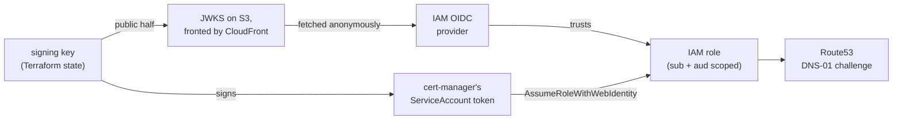

# sre-homelab

Terraform for a single-node [k3s](https://k3s.io/) homelab on [Hetzner Cloud](https://www.hetzner.com/cloud/), where `cert-manager` authenticates to AWS Route53 by federating the cluster's own identity into IAM — the same mechanism EKS calls IRSA — instead of holding a static AWS access key.

This repo builds the cluster and the AWS identity it uses. Everything that actually *runs* on the cluster — ArgoCD applications, ingress rules, RBAC — lives in the companion repo, [`sre-homelab-gitops`](https://github.com/sbhiii/sre-homelab-gitops).

## Why

`cert-manager` needs to write TXT records into Route53 to complete ACME DNS-01 challenges. The obvious way to grant that is an IAM user with an access key, dropped into a Kubernetes Secret. That's also the wrong way: it's a long-lived, unrotated, human-shaped credential sitting in a cluster that has no business holding one.

This repo instead generates the cluster's own ServiceAccount token-signing key in Terraform, publishes the corresponding JWKS to a URL the cluster owns, and grants a narrowly-scoped IAM role to exactly one ServiceAccount via `sts:AssumeRoleWithWebIdentity`. No AWS credential is stored anywhere. `cert-manager` mints a token, AWS validates it against a public key it fetched itself, and the token proves nothing except "I am this specific ServiceAccount, in this specific cluster."

This is precisely what EKS does under the hood for IRSA. The difference is that EKS runs the OIDC issuer for you — here it's homemade, Terraform and S3/CloudFront standing in for what a managed control plane would otherwise provide.

## Documentation

| | |
|---|---|
| **[Architecture](docs/architecture.md)** | Why three Terraform modules, the full bootstrap chain, the OIDC trust chain in detail, and why not EKS / IAM Roles Anywhere / SPIFFE |
| **[Getting started](docs/getting-started.md)** | Prerequisites — tools, accounts, background knowledge — and a full walkthrough for forking and bootstrapping the stack from nothing |
| **[Operations](docs/operations.md)** | Kubeconfig, node rebuilds, key rotation, cost, troubleshooting |
| **[Security model](docs/security.md)** | What has no credential, what's still a secret and why, the metadata-service mitigation, and known limitations stated plainly |

## Related repository

[`sre-homelab-gitops`](https://github.com/sbhiii/sre-homelab-gitops) holds everything ArgoCD manages once the cluster exists: the app-of-apps bootstrap, `cert-manager`'s `ClusterIssuer` and RBAC, Traefik, and the `NetworkPolicy` layer that's the other half of the metadata-service mitigation. Read this repo for how the cluster and its AWS identity get built; read that one for what actually runs.
