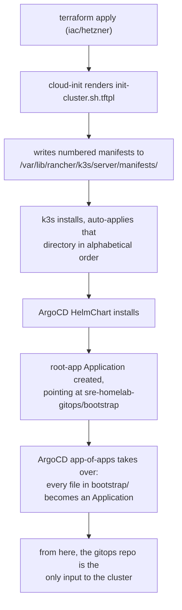
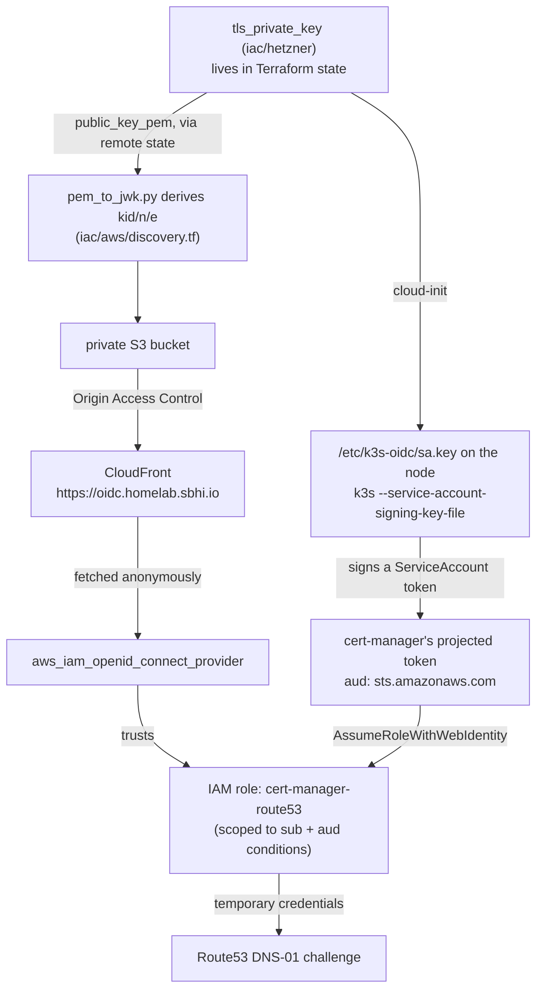

[← Back to README](../README.md) · [Getting started](getting-started.md) · [Operations](operations.md) · [Security model](security.md)

# Architecture

## Three Terraform modules, not one

```
iac/
  bootstrap/   state bucket only. Local state, on purpose. Applied once, ever.
  aws/         OIDC provider, IAM role, discovery documents, DNS records
  hetzner/     the cluster itself: network, firewall, server, signing key
```

`iac/hetzner` recreates its server on almost every meaningful change, because the node's `user_data` is immutable on Hetzner — there is no in-place update, only replace. If IAM and DNS lived in the same state as the node, every rebuild would put unrelated cloud resources in the same blast radius for no reason. Splitting them means a node rebuild touches exactly the node.

`iac/bootstrap` is the odd one out: it creates the S3 bucket that the other two modules use as their *own* backend, so it cannot store its state inside a bucket that doesn't exist yet. It keeps local state permanently, by design — see [`iac/bootstrap/README.md`](../iac/bootstrap/README.md).

Apply order is always **`hetzner` → `aws`**, never the reverse. `iac/aws` reads two things out of `iac/hetzner`'s state via `terraform_remote_state`:

- `sa_public_key_pem` — the public half of the signing key, used to build the JWKS.
- `nodes_public_ips` — the node's current IP, used for the wildcard DNS record in [`iac/aws/apps_dns.tf`](../iac/aws/apps_dns.tf).

Only the *public* key ever crosses that boundary. The private half stays inside `iac/hetzner`'s state and is never exported as an output.

## The zone belongs to a different repository

`iac/aws` writes records into a hosted zone it does not create. The zone is defined in [`sbhi-aws-landing-zone`](https://github.com/sbhiii/sbhi-aws-landing-zone), which also owns the AWS account all of this applies into.

The line falls where it does because destroying the zone is not recoverable by an apply: a replacement gets a new delegation set, so the NS records have to be corrected by hand at the external DNS provider. Anything whose destruction forces a manual edit outside AWS outlives this cluster and is not the cluster's to manage. Everything else here is derived from the signing key or points at the node's current address, so it is recreated whenever the cluster is, and a node rebuild must not require an apply in the landing zone. That rule is recorded as decision 14 there.

The contract between the two repositories is the zone's *name*, resolved with a `data "aws_route53_zone"` lookup rather than another `terraform_remote_state` read. A name is stable; a state file is an implementation detail, and sharing one would let a failed apply in either repository block the other.

The practical consequence when bootstrapping: the zone and its delegation must already exist, or `iac/aws` fails at plan time. See [Getting started](getting-started.md#prerequisites).

## The bootstrap chain

Nothing is ever applied to the cluster by hand. The whole chain, from an empty Hetzner project to a syncing ArgoCD instance, is:



Concretely, [`iac/hetzner/scripts/init-cluster.sh.tftpl`](../iac/hetzner/scripts/init-cluster.sh.tftpl) does five things at first boot:

1. Applies a couple of sysctl tweaks k3s wants (`fs.inotify.max_user_instances`).
2. Writes three Terraform-rendered manifests into k3s's auto-apply directory, prefixed `01-`, `02-`, `03-` — k3s applies that directory alphabetically, which is the entire ordering mechanism. They are: the ArgoCD `HelmChart`, a `Secret` holding the gitops repo credentials, and the `root-app` `Application` that makes ArgoCD self-managing from that point on.
3. Writes the ServiceAccount signing keypair to `/etc/k3s-oidc/` (`0600` on the private half).
4. Installs k3s itself, with `--disable traefik --disable servicelb` (both are reprovided through GitOps instead) and four `--kube-apiserver-arg` flags that turn on OIDC federation — see below.
5. Installs a `systemd` unit blocking pod traffic to Hetzner's metadata service — see [Security model](security.md).

Everything after step 2 is GitOps: `root-app` is an app-of-apps, so every file under `sre-homelab-gitops/bootstrap/` becomes its own ArgoCD `Application`, synced in the order given by its `argocd.argoproj.io/sync-wave` annotation. Manual `kubectl edit` on anything ArgoCD owns gets reverted on the next reconcile.

## The OIDC trust chain



The property this whole design is built around: **the signing key lives in Terraform state, not on the node.** A `user_data` change replaces the Hetzner server, but leaves the `tls_private_key` resource in [`iac/hetzner/keys.tf`](../iac/hetzner/keys.tf) completely untouched. The published JWKS, the IAM provider, and the trust policy all stay valid across a node rebuild — only a full `terraform destroy` of the `hetzner` module mints a new identity, and that requires re-applying `iac/aws` afterward to republish the new key.

A few details that took real iteration to get right, and are worth knowing before touching this code:

- **The `kid` must byte-match exactly.** Kubernetes computes a token's `kid` header as `base64url(sha256(DER-encoded PKIX public key))`. [`iac/aws/scripts/pem_to_jwk.py`](../iac/aws/scripts/pem_to_jwk.py) reimplements that from scratch in pure Python (no `cryptography` dependency, so it runs anywhere Terraform does) via a hand-rolled DER/TLV parser. [`test_pem_to_jwk.py`](../iac/aws/scripts/test_pem_to_jwk.py) pins it against a fixture cross-verified with `openssl`. This was independently verified against the live cluster's own JWKS output and matched exactly — see the git history for `iac/aws/discovery.tf` if you want the receipts.
- **`cache_control` on the discovery objects is load-bearing, not decoration.** CloudFront's managed `CachingOptimized` policy defaults to a 24-hour TTL. Without an explicit override, rotating the signing key would leave AWS reading a stale JWKS and rejecting every token with an opaque error for up to a day. It's capped at five minutes instead.
- **The trust policy carries two conditions, not one.** `${issuer_host}:sub` pins the exact ServiceAccount; `${issuer_host}:aud` pins the audience to `sts.amazonaws.com`. Dropping the `aud` condition is the single most common IRSA misconfiguration in the wild — it lets a token minted for *any* audience assume the role.
- **`route53:ListHostedZonesByName` is deliberately absent from the IAM policy.** The gitops repo's `ClusterIssuer` sets `hostedZoneID` explicitly, which skips the lookup that permission would otherwise be needed for. The policy is two actions on one zone; see [`iac/aws/iam.tf`](../iac/aws/iam.tf).

## Why not EKS, IAM Roles Anywhere, or SPIFFE

Worth being explicit about, since it's the first question anyone who knows this space will ask.

**EKS** would give you all of this for free — a managed OIDC issuer, automatic key rotation, no S3/CloudFront to run. It also costs money per cluster and defeats the point of running k3s on a single Hetzner box. What's built here is the same mechanism EKS uses, minus the managed control plane doing the work.

**IAM Roles Anywhere** is AWS's purpose-built answer for non-Kubernetes workloads outside AWS: X.509 trust anchors, no public JWKS, no DNS, no CloudFront. It loses here for a specific reason — `cert-manager`'s Route53 solver natively supports `auth.kubernetes.serviceAccountRef` and does not support Roles Anywhere. Using it would mean running `aws_signing_helper` sidecars and a PKI to feed a tool that already speaks projected tokens natively.

**SPIFFE/SPIRE** is the real gold standard for workload identity, and it would fix the one thing this design can't: it never needs to override the cluster's own SA signing key, so the private key never has to leave the SPIRE Server's own storage. The trade is a control plane (SPIRE Server + Agent + an OIDC discovery provider of its own) for a single node with one AWS consumer. Worth reconsidering if this cluster ever needs mTLS between services, or grows past a handful of AWS-integrated workloads.

## Repository layout

```
iac/
  bootstrap/              state bucket (local state, applied once)
    main.tf                aws_s3_bucket + versioning + encryption + public-access-block
                           + ownership controls + TLS-only bucket policy
    variables.tf, outputs.tf, providers.tf, README.md

  aws/                     IAM/DNS/discovery stack (state in S3)
    dns.tf                  zone lookup, ACM certificate (us-east-1) + validation
    discovery.tf             JWKS derivation, S3 bucket, CloudFront, OAC, bucket policy
    iam.tf                   IAM OIDC provider, cert-manager IAM role and trust policy
    apps_dns.tf              wildcard A record for the cluster's ingress hostnames
    scripts/
      pem_to_jwk.py           PEM -> JWK, pure stdlib
      test_pem_to_jwk.py      unit tests against a cross-verified fixture
    backend.tf, providers.tf, variables.tf, outputs.tf

  hetzner/                 the cluster itself (state in S3)
    main.tf                  network, firewall, hcloud_server
    keys.tf                   tls_private_key for SA token signing
    scripts/init-cluster.sh.tftpl   cloud-init: manifests, signing key, k3s install, iptables rule
    manifests/                ArgoCD HelmChart, repo credentials, root Application (all templated)
    backend.tf, providers.tf, variables.tf, outputs.tf
```

---

[← Back to README](../README.md) · [Getting started →](getting-started.md)
